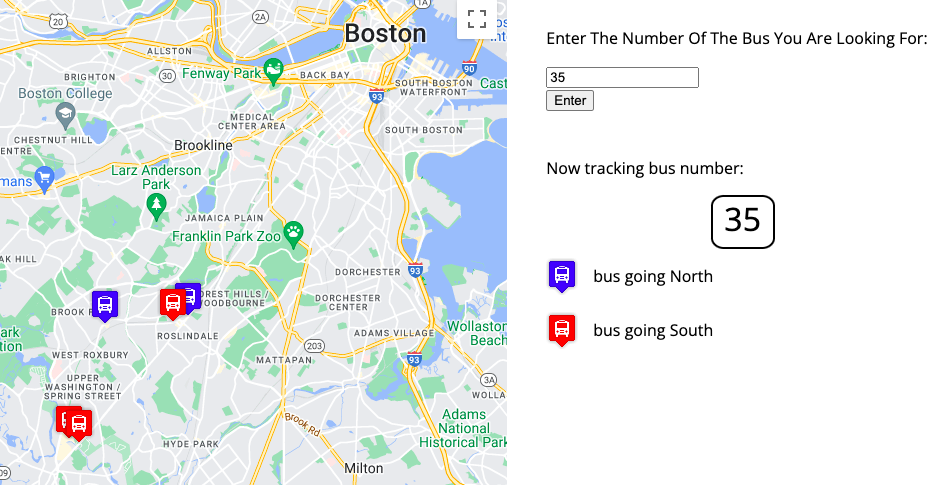

# Real Time Bus Tracker

### Tracks Boston Buses and Displays Icons on the Map

##### This app uses a Google Maps API in combination with an API provided by the Massachusetts Bay Transit Authority to mark 
each bus on the map. 

Instructions:
Enter the bus number you would like to track in the input field on the right, press the "enter" button on the screen.
The default route will be Bus#1 going between MIT and Harvard.

Features:
- Updates every 15 seconds
- Busses are colored red or blue based on the direction

Full disclosure: most of the code was provided by the MITxPro instructors. 

My contributions are:
- The feature that allows a user to select a particular bus number
- The legend that explains which bus is being tracked and what Blue/Red icons represent
- I decreased the zoom to better see routes further away from downtown Boston
- Responsive to smaller screen sizes

Possible Future improvements:
- Make the zoom automatically adjust based on the route selected

To run this project you can either fork this repository and view it on your computer
or see it in action at https://ilyaflaks.github.io/bus-tracker/
Note that in the first case you might need to plug in your own Google Maps API key in mapanimation.js

MIT License

##Enjoy!
